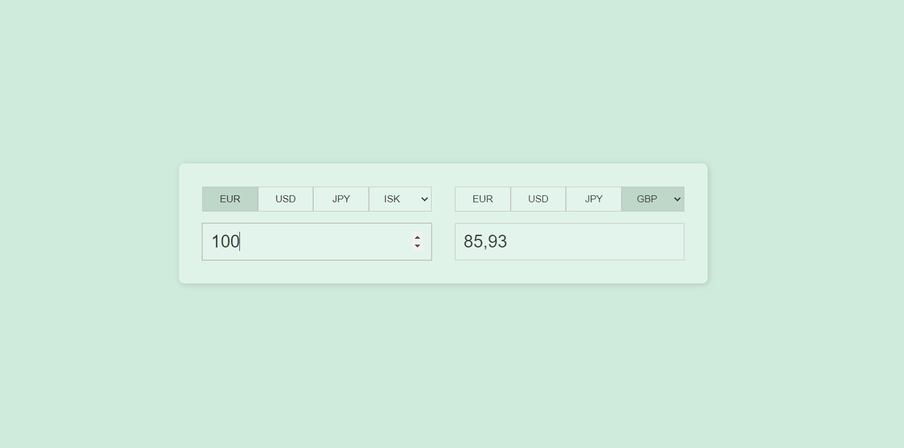

# Currency Converter

### About:
This project is a straightforward currency converter application powered by an API request. Users select two currencies — source and target — then input an amount to be automatically converted into the desired currency. Currency selection is facilitated through buttons or a dropdown menu, providing a user-friendly experience for seamless conversion between the most common currencies.

### Demo:

### Technologies Used:

### Packages Used:
- [JS Currency Converter](https://www.npmjs.com/package/@everapi/freecurrencyapi-js)

### Other Links:
- [Free Currency Api](https://app.freecurrencyapi.com/)

